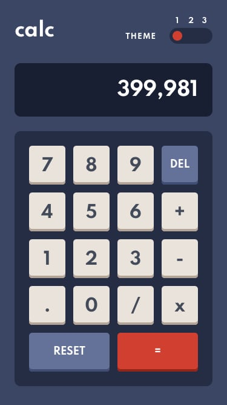

    
   

   
   
   <h1 align="center">Calculator - Frontend Mentor Challenge</h1>

  
  
## The challenge

Your challenge is to build out this calculator app and get it looking as close to the design as possible.

You can use any tools you like to help you complete the challenge. So if you've got something you'd like to practice, feel free to give it a go.

Your users should be able to:

See the size of the elements adjust based on their device's screen size

Perform mathematical operations like addition, subtraction, multiplication, and division

Adjust the color theme based on their preference

**Bonus:** Have their initial theme preference checked using prefers-color-scheme and have any additional changes saved in the browser

## Desktop Design

  

  

  

## Mobile Design

  

  

  

## Demo
[https://frontend-mentor-count-down.vercel.app/](https://frontend-mentor-count-down.vercel.app/)

## Project
### Tools

- React.js
- Create-react-app
- Chakra UI

### Project Structure
The files are structured as follow:

    .
    ├── docs
    ├── public               # Static Files
    ├── src
        ├── components  
            ├── ButtonCalc.tsx      
            ├── Calculator.tsx
            ├── Display.tsx
            ├── ThemeSwitch.tsx
            ├── shadowColors.ts
            ├── useCalculator.ts
        ├── themes      
            ├── theme1.ts      
            ├── theme2.ts
            ├── theme3.ts
        App.tsx
        ThemeContext.ts
        index.css
        index.ts

    └── README.md            # The first page that the user will view when will visit the repository.

